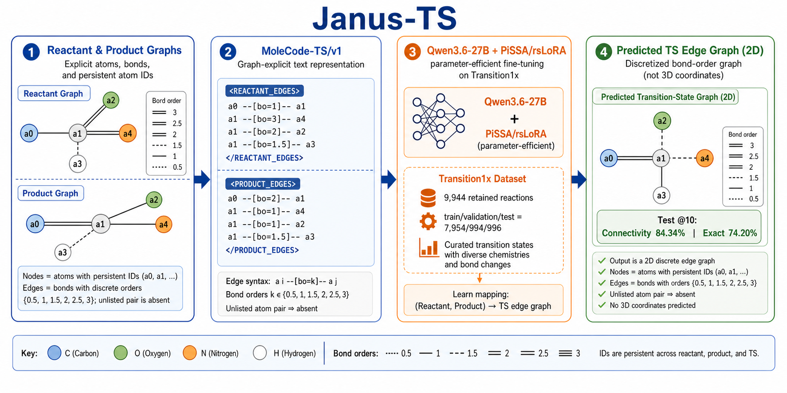
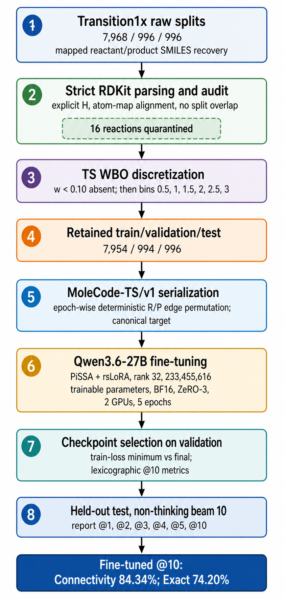

# Janus-TS：基于图显式分子语言与参数高效大模型微调的离散过渡态分子图预测

> **文档定位。** 本文是依据当前仓库、冻结实验契约和已完成实验产物整理的中文论文初稿。
> 正式结果仅涵盖 non-thinking 推理，并以原始 Qwen3.6-27B 的 zero-shot non-thinking
> 结果作为唯一对照。本文不主张达到当前最优水平，也不包含尚未完成的 RGD1 实验。

## Abstract

过渡态结构连接反应物与产物，是反应机理分析和势垒计算的核心对象，但高质量过渡态数据昂贵且
稀缺。Janus-TS 将这一问题表述为条件文本生成：给定共享原子编号的反应物图和产物图，预测经过
离散化的过渡态边集合及其键级。我们基于 MoleCode 的图显式思想设计了 MoleCode-TS/v1，使原子、
组分、键、立体信息和反应前后变化均以可审计的文本块表示，并以仅含边和键级的规范化
`<TS_EDGES>` 块作为监督目标。在 Transition1x 派生数据上，经严格化学解析和去泄漏审计后保留
7,954/994/996 条训练/验证/测试反应。固定版本的 Qwen3.6-27B 采用 PiSSA 初始化的 rsLoRA 进行
五轮 BF16 参数高效微调，使用两张 GPU、ZeRO-3 和全局批量 16。最终 checkpoint 在测试集的
non-thinking beam-10 推理中取得 84.3373% Connectivity 和 74.1968% Exact，大幅高于同模型
zero-shot 对照的 27.7108% 和 13.7550%。结果表明，图显式表示与任务微调能够使通用语言模型学习
反应物/产物图到离散过渡态图的映射；但当前证据限于单一数据集和同模型 zero-shot 对照，且不涉及
三维坐标、能量或过渡态立体化学预测。



**Figure 1. Janus-TS graphical abstract.** 反应物和产物共享显式原子编号，MoleCode-TS/v1 将图
结构转写为显式文本，Qwen3.6-27B 经 PiSSA/rsLoRA 微调后输出二维离散过渡态边图。图中分子仅为
概念示意，并非数据集中的具体反应。

## Introduction

过渡态位于化学反应路径的高能区域，其几何结构和电子结构决定了反应势垒、选择性与可能的反应
机理。与平衡构型相比，可靠的过渡态计算需要反应路径搜索和量子化学优化，因此适用于机器学习的
反应区域数据长期不足。Transition1x 通过约 10,000 个有机反应的 nudged elastic band 计算，提供
了约 960 万个位于反应路径附近的密度泛函理论构型，为反应区域机器学习建立了重要数据基础[1]。
本研究不直接拟合连续势能面，而是使用其中的反应物、产物和过渡态信息，研究一个更受约束的任务：
能否从反应物与产物的分子图预测离散过渡态分子图。

分子表示决定了语言模型实际需要学习的问题。SMILES 将原子、支链和环闭合编码为紧凑字符串[2]；
SELFIES 进一步用形式语法提高生成表示的稳健性[3]。这些线性表示适合存储与交换，但图拓扑仍需由
模型从序列语法中恢复。MoleCode 提出使用持久化实体编号和显式关系，使分子拓扑可以被语言模型
直接读取、编辑和审计[4]。Janus-TS 借鉴的是这一“图结构本身应成为语言内容”的原则，而不是复刻
原版 MoleCode 的全部语法或声称继承其所有能力。为过渡态任务设计的 MoleCode-TS/v1 使用一个由
反应物、产物和过渡态共享的显式原子表，分别表示反应物与产物的组分、原子属性、键和立体信息，
并显式列出原子与边的变化。

本研究选择 Qwen3.6-27B 作为生成模型。该模型是具有 64 层混合线性注意力/全注意力结构的 27B
级开放权重模型[5]；本项目仅使用其文本解码器。为在有限硬件上适配大模型，我们采用低秩适配
（LoRA）框架[6]、rank-stabilized LoRA（rsLoRA）缩放[7]和 principal singular values and
singular vectors adaptation（PiSSA）初始化[8]。LoRA 冻结基础权重并训练低秩增量，rsLoRA
使用与秩平方根相关的缩放以稳定较高秩设置，PiSSA 则以原权重的主奇异方向初始化适配器。训练端
结合 ZeRO-3 分片[9]和激活重计算，使该 27B 模型可以在两张 RTX 4090 GPU 上以原生 BF16 完成
五轮微调。

研究目标是检验图显式文本表示与参数高效微调能否学习“反应物图 + 产物图 → 离散过渡态边图”
映射。核心评价量为 Connectivity，即完整边集合是否正确，以及 Exact，即边集合和全部离散键级
是否同时正确。实验以相同版本、相同输入表示和相同 non-thinking beam-10 解码协议下未经训练的
Qwen3.6-27B 作为 zero-shot 对照。由于没有与其他已训练过渡态模型进行同数据、同划分、同指标的
直接比较，本文只讨论任务内的绝对性能和相对于同模型 zero-shot 的变化，不作 SOTA 声明。

## Results

### Data integrity and model training

原始划分包含 7,968/996/996 条训练/验证/测试反应。严格端点解析、原子映射对齐和一致性检查后，
16 条无法可靠恢复的反应被整体隔离，最终保留 7,954/994/996 条记录。隔离发生在训练集和验证集，
测试集 996 条全部保留。处理后数据中不存在跨划分 reaction ID 重叠，也不存在去原子映射、保留
方向的规范化 `R>>P` 签名重叠；所有端点和目标均可被严格解析。训练五个逻辑 epoch 的最大完整
序列长度为 1,795 tokens，验证和测试最大长度分别为 1,771 和 1,907，均低于 2,048-token 硬上限，
没有发生截断。

正式训练共完成 2,490 个优化器步，每个 epoch 为 498 步。总训练运行时间为 128,284.6 s
（约 35 h 38 min），记录的全程平均训练损失为 0.0136094；最终第 2,490 步的精确步损失为
0.00161344。这里的损失是跨设备按监督 token 数归一化的自回归交叉熵，数值大小不等价于图级
准确率。保存的最低精确步训练损失 checkpoint 与第五轮最终 checkpoint 为同一对象，因此验证时
只评估了一个去重候选。其验证损失为 0.0202861，并被锁定为唯一测试 checkpoint。



**Figure 2. End-to-end experimental workflow.** 从内容固定的 Transition1x 派生划分开始，流程依次
执行化学解析和去泄漏审计、Wiberg 键级离散化、MoleCode-TS/v1 序列化、Qwen3.6-27B 参数高效
微调、验证集 checkpoint 选择和一次性独立测试集评估。

### Validation performance and checkpoint selection

验证集使用 deterministic non-thinking beam search，保留十条原始 beam，并报告前
1/2/3/4/5/10 条候选的结果。每个指标分别在前 *k* 条候选中取最优值；因此同一行中的不同指标
不一定来自同一条候选。完整验证结果见 Table 1。随着 *k* 从 1 增加到 10，Connectivity 从
63.1791% 上升到 83.5010%，Exact 从 46.7807% 上升到 72.9376%，平均 edit bond 从 1.4044
下降到 0.4859。验证集的 `@10` 结果按 Connectivity、Exact、edit bond、Edge IoU、Edge F1、
evaluation loss 的顺序进行字典序 checkpoint 比较。

**Table 1. Fine-tuned checkpoint performance on the validation split (n = 994).** Connectivity 和
Exact 括号内为成功数/总数；edit bond 括号内为反应级 P50/P95。

| k | Connectivity | Exact | edit bond ↓ (P50/P95) | Edge IoU ↑ | Edge F1 ↑ |
|---:|---:|---:|---:|---:|---:|
| @1 | 63.1791% (628/994) | 46.7807% (465/994) | 1.4044 (1/5) | 0.9608 | 0.9780 |
| @2 | 71.7304% (713/994) | 56.8410% (565/994) | 1.0342 (0/4) | 0.9715 | 0.9843 |
| @3 | 75.5533% (751/994) | 61.8712% (615/994) | 0.7767 (0/4) | 0.9776 | 0.9881 |
| @4 | 77.2636% (768/994) | 64.7887% (644/994) | 0.6952 (0/3) | 0.9796 | 0.9892 |
| @5 | 78.4708% (780/994) | 66.3984% (660/994) | 0.6449 (0/3) | 0.9813 | 0.9901 |
| @10 | **83.5010% (830/994)** | **72.9376% (725/994)** | **0.4859 (0/3)** | **0.9865** | **0.9929** |

**Table 2. Validation-set 95% confidence intervals.** 二元指标采用 Wilson 区间；均值型辅助指标采用
反应级 BCa bootstrap（10,000 次重采样，seed 42）。

| k | Connectivity | Exact | edit bond | Edge IoU | Edge F1 |
|---:|---:|---:|---:|---:|---:|
| @1 | 60.1353–66.1214% | 43.6972–49.8890% | 1.2485–1.7850 | 0.9555–0.9650 | 0.9732–0.9807 |
| @2 | 68.8515–74.4420% | 53.7415–59.8880% | 0.9095–1.4165 | 0.9671–0.9749 | 0.9804–0.9863 |
| @3 | 72.7866–78.1233% | 58.8116–64.8395% | 0.6982–0.8612 | 0.9745–0.9803 | 0.9864–0.9896 |
| @4 | 74.5560–79.7613% | 61.7677–67.6959% | 0.6197–0.7746 | 0.9768–0.9822 | 0.9876–0.9906 |
| @5 | 75.8086–80.9138% | 63.4038–69.2667% | 0.5757–0.7213 | 0.9786–0.9838 | 0.9886–0.9914 |
| @10 | **81.0654–85.6786%** | **70.0913–75.6073%** | **0.4286–0.5503** | **0.9843–0.9885** | **0.9917–0.9940** |

### Held-out test performance

锁定 checkpoint 后，微调模型只在完整 996 条测试反应上运行一次正式 non-thinking 评估。Table 3
给出全部 *k* 值。`@1` Connectivity 和 Exact 分别为 60.9438% 和 47.3896%；`@10` 分别达到
84.3373% 和 74.1968%。从 `@1` 到 `@10`，两项主指标分别增加 23.3935 和 26.8072 个百分点，
同时 edit bond 从 1.3353 降至 0.5141。测试结果与验证结果接近；例如验证/测试 `@10`
Connectivity 为 83.5010%/84.3373%，Exact 为 72.9376%/74.1968%，未观察到明显的验证—测试
性能坍塌，但本研究没有进行二者等价性检验。

**Table 3. Fine-tuned Qwen3.6-27B on the held-out test split (n = 996).**

| k | Connectivity | Exact | edit bond ↓ (P50/P95) | Edge IoU ↑ | Edge F1 ↑ |
|---:|---:|---:|---:|---:|---:|
| @1 | 60.9438% (607/996) | 47.3896% (472/996) | 1.3353 (1/5) | 0.9574 | 0.9769 |
| @2 | 70.7831% (705/996) | 59.7390% (595/996) | 0.9428 (0/4) | 0.9699 | 0.9838 |
| @3 | 75.5020% (752/996) | 63.6546% (634/996) | 0.8133 (0/4) | 0.9748 | 0.9864 |
| @4 | 77.9116% (776/996) | 67.4699% (672/996) | 0.7219 (0/4) | 0.9774 | 0.9878 |
| @5 | 79.8193% (795/996) | 68.9759% (687/996) | 0.6667 (0/3) | 0.9799 | 0.9892 |
| @10 | **84.3373% (840/996)** | **74.1968% (739/996)** | **0.5141 (0/3)** | **0.9851** | **0.9920** |

**Table 4. Fine-tuned test-set 95% confidence intervals.**

| k | Connectivity | Exact | edit bond | Edge IoU | Edge F1 |
|---:|---:|---:|---:|---:|---:|
| @1 | 57.8774–63.9261% | 44.3046–50.4946% | 1.2289–1.4538 | 0.9530–0.9615 | 0.9744–0.9792 |
| @2 | 67.8834–73.5232% | 56.6614–62.7416% | 0.8544–1.0442 | 0.9661–0.9733 | 0.9816–0.9857 |
| @3 | 72.7364–78.0716% | 60.6203–66.5840% | 0.7299–0.9083 | 0.9712–0.9780 | 0.9843–0.9882 |
| @4 | 75.2308–80.3780% | 64.4981–70.3074% | 0.6426–0.8112 | 0.9740–0.9804 | 0.9859–0.9895 |
| @5 | 77.2143–82.1951% | 66.0347–71.7713% | 0.5914–0.7520 | 0.9766–0.9827 | 0.9874–0.9907 |
| @10 | **81.9488–86.4621%** | **71.3901–76.8176%** | **0.4478–0.5884** | **0.9823–0.9875** | **0.9904–0.9933** |

### Zero-shot control and fine-tuning effect

zero-shot 对照直接加载相同 revision 的 Qwen3.6-27B，不附加适配器、不执行训练更新，也不加入
示例演示；其余输入表示、系统指令、non-thinking 模式、beam 数、返回序列数和 512-token 输出上限
与微调模型一致。其完整测试结果见 Table 5。zero-shot `@10` Connectivity 为 27.7108%，Exact
为 13.7550%。相对于该对照，微调模型在 `@10` 的 Connectivity 和 Exact 分别高 56.6265 和
60.4418 个百分点，平均 edit bond 低 2.0231，Edge IoU 和 Edge F1 分别高 0.0695 和 0.0391。
在 `@1` 下，两项主指标的差值仍为 37.0482 和 38.2530 个百分点。这些数值支持“微调后的模型在
本任务和本划分上优于未经更新的同一基础模型”，但不能替代与其他已训练方法的比较。

**Table 5. Zero-shot Qwen3.6-27B on the held-out test split (n = 996).**

| k | Connectivity | Exact | edit bond ↓ (P50/P95) | Edge IoU ↑ | Edge F1 ↑ |
|---:|---:|---:|---:|---:|---:|
| @1 | 23.8956% (238/996) | 9.1365% (91/996) | 17.8233 (3/92) | 0.7292 | 0.7569 |
| @2 | 26.3052% (262/996) | 11.2450% (112/996) | 9.5452 (3/56) | 0.8223 | 0.8542 |
| @3 | 27.0080% (269/996) | 11.8474% (118/996) | 6.1988 (3/46) | 0.8615 | 0.8952 |
| @4 | 27.1084% (270/996) | 12.3494% (123/996) | 4.9227 (2/8) | 0.8827 | 0.9182 |
| @5 | 27.3092% (272/996) | 12.8514% (128/996) | 3.8715 (2/7) | 0.8973 | 0.9338 |
| @10 | **27.7108% (276/996)** | **13.7550% (137/996)** | **2.5371 (2/6)** | **0.9156** | **0.9529** |

**Table 6. Zero-shot test-set 95% confidence intervals.**

| k | Connectivity | Exact | edit bond | Edge IoU | Edge F1 |
|---:|---:|---:|---:|---:|---:|
| @1 | 21.3507–26.6411% | 7.5007–11.0864% | 15.8594–19.9952 | 0.7045–0.7522 | 0.7313–0.7806 |
| @2 | 23.6656–29.1269% | 9.4300–13.3577% | 8.2679–10.9979 | 0.8035–0.8394 | 0.8349–0.8714 |
| @3 | 24.3428–29.8499% | 9.9855–14.0025% | 5.3573–7.2018 | 0.8458–0.8753 | 0.8792–0.9089 |
| @4 | 24.4397–29.9531% | 10.4496–14.5385% | 4.2189–5.8032 | 0.8698–0.8938 | 0.9052–0.9290 |
| @5 | 24.6333–30.1595% | 10.9149–15.0734% | 3.3428–4.5843 | 0.8865–0.9061 | 0.9232–0.9421 |
| @10 | **25.0209–30.5720%** | **11.7548–16.0337%** | **2.3745–2.8183** | **0.9094–0.9206** | **0.9476–0.9564** |

beam 扩展对微调模型和 zero-shot 模型的作用不同。微调模型从 `@1` 到 `@10` 获得较大的主指标
增益，而 zero-shot Connectivity 和 Exact 仅分别增加 3.8152 和 4.6185 个百分点。一个合理但
仍需进一步实验验证的解释是，任务微调不仅提高了首选输出质量，也在多个 beam 中形成了更有用的
候选多样性。由于 `@k` 是 oracle 式评价且计算成本随候选数增加，`@10` 不应被解释为单次首选
预测的准确率；实际单输出性能由 `@1` 更直接反映。

## Methods

### Study design and reproducibility contract

本研究采用预先冻结的计算实验协议。模型 revision、原始文件 SHA256、数据划分、表示版本、随机
种子、离散化边界、训练超参数、checkpoint 候选集合、指标优先级和推理解码参数均进入内容指纹。
任何冻结字段变化都会产生新的数据或运行身份，而不会静默改变进行中的实验。随机种子固定为 42。
生成数据、checkpoint、预测和指标位于内容寻址的 `artifacts/` 目录；阶段完成由原子化 completion
marker 和 manifest 证明，而不是依赖文件修改时间。

### Dataset preparation and chemical validation

数据来源是 Transition1x 派生的三个固定 pickle 划分。原始划分决定 reaction membership 和
过渡态 Wiberg bond order（WBO）；另一个内容固定的 hybrid JSONL 只提供恢复后的反应物/产物原子
映射 SMILES，不改变划分、TS 标签、坐标或能量。Transition1x 原论文中的构型来自
ωB97X/6-31G(d) 级别的反应路径计算[1]；Janus-TS 不重新执行这些 DFT 计算，也不重新计算输入文件
中的 WBO，因此标签理论层级和上游 WBO 生成误差属于数据来源而非本模型优化的一部分。

所有端点使用 RDKit 进行严格 sanitization，并保留显式氢。原子映射必须恰好为 1 到 *N*，且映射
位置 *i* 的原子序数必须与原始 `atom_types[i-1]` 一致。通过验证的分子重新生成反应物/产物原子、
形式电荷、自由基电子数、连通组分、键以及 E/Z 和 R/S 信息；不保留已知畸形 pickle 中的端点边。
共有 476 个恢复端点按此规则重建。16 条仍不能满足契约的反应作为完整样例隔离。处理后的 Arrow
数据通过 Hugging Face Datasets 以磁盘映射方式读取[13]。

为避免信息泄漏，审计同时检查跨划分 reaction ID 和完整方向性反应签名。后者将反应物和产物分别
转换为去原子映射但保留同位素/立体信息的 RDKit canonical isomeric SMILES，再构成有方向的
`R>>P` 签名。两个检查的交集均为零。数据还通过规范序列化往返、严格目标解析和全量 token 长度
检查。RDKit 的软件引用和版本建议遵循其官方说明[14]。

### Transition-state WBO discretization

每条原始 TS 边包含两个原子索引和连续 WBO。首先删除小于 0.10 的值，随后使用与项目所参考
GeoDiff 代码路径一致的分段规则[15]，得到六个允许输出键级。边界采用高区间左闭，即恰好等于
0.75 的值映射为 1.0，而不是 0.5。所有非有限 WBO 均触发硬错误，不被静默归一化。

| Raw WBO, *w* | Discrete bond order |
|---|---:|
| *w* < 0.10 | absent |
| 0.10 ≤ *w* < 0.75 | 0.5 |
| 0.75 ≤ *w* < 1.25 | 1.0 |
| 1.25 ≤ *w* < 1.75 | 1.5 |
| 1.75 ≤ *w* < 2.25 | 2.0 |
| 2.25 ≤ *w* < 2.75 | 2.5 |
| *w* ≥ 2.75 | 3.0 |

### MoleCode-TS/v1 representation

MoleCode-TS/v1 借鉴 MoleCode 的持久标识符和显式关系设计[4]，但针对条件 TS 图预测进行了专门
约束。反应物、产物和 TS 共用一个零起始原子表；每个原子至少包含元素符号和原子序数。反应物与
产物分别具有组分块、稀疏原子属性块和边块。非零形式电荷、自由基电子数和 R/S 构型写入原子属性；
键级以及可用的 E/Z 信息写入端点边。额外的 atom-change 和 edge-change 块显式呈现反应前后
差异，但这些变化是证据而非输出硬约束。

监督目标只包含规范排序的 `<TS_EDGES>` 块。每条边写成
`aI --[bo=B]-- aJ`，要求 `I < J`，其中 *B* 属于六个离散键级；未列出的原子对表示无边。目标
允许连接原子表中的任意一对原子，即使该对在反应物和产物中都没有键。因此，只要转移氢被显式
列入共享原子表，断裂的供体—H 边和形成的受体—H 边都可表示。R/P 输入保留立体信息，但 TS
目标有意不预测 E/Z、R/S、组分、原子属性或坐标。

训练时只扰动反应物和产物边行的顺序。排列键由
`(seed, logical epoch, reaction ID, section, atom_i, atom_j)` 的 SHA256 决定，因此同一分子图在每个
逻辑 epoch 会获得一次新的、无状态且可复现的边顺序；不同 worker 数、rank 数或断点恢复不会改变
该顺序。原子表、属性、组分和变化块不扰动，全部目标始终规范排序。验证集、测试集和 zero-shot
输入也始终采用规范顺序。

### Prompt construction and token-level supervision

输入通过固定 Qwen chat template 构造为 system 和 user 两个上下文 turn，assistant turn 使用
`enable_thinking=false`。系统指令定义任务、共享原子编号、允许键级、任意原子对可成 TS 边以及
严格的单块输出格式。Qwen 模板产生的空 `<think>\n\n</think>\n\n` 前缀保留在上下文中，但与
system、user 和 assistant role marker 一起全部 mask。监督从 `<TS_EDGES>` 的第一个 token 开始，
一直覆盖目标和末尾 `<|im_end|>` token。

完整序列硬上限为 2,048 tokens，动态 padding 到 8 的倍数。tokenization 禁止截断；任何超长样例
都会使数据审计失败。损失仅在目标 token 上计算，并跨两张 GPU 汇总监督 token 数后归一化，避免
不同 rank 上目标长度不同造成等权平均偏差。

### Base model and parameter-efficient adaptation

基础模型固定为 `Qwen/Qwen3.6-27B` revision
`6a9e13bd6fc8f0983b9b99948120bc37f49c13e9`[5]。模型具有 64 个 decoder layer 和 5,120 hidden
dimension；官方结构为每四层中三层 Gated DeltaNet 线性注意力和一层 gated full attention。本项目
只加载文本 decoder，不使用视觉编码器。

基础参数冻结。训练适配器采用 LoRA[6] 的低秩结构、rsLoRA 缩放[7]和 `pissa_niter_16` 初始化[8]。
rank 为 32，alpha 为 16，dropout 为 0，bias 不训练。适配覆盖所有 64 层的 MLP `gate_proj`、
`up_proj`、`down_proj`；48 个线性注意力层的 `in_proj_qkv`、`in_proj_z`、`in_proj_b`、
`in_proj_a`、`out_proj`；以及 16 个全注意力层的 `q_proj`、`k_proj`、`v_proj`、`o_proj`。总计
精确覆盖 496 个 projection，训练参数为 233,455,616。输出 `lm_head` 保持冻结。

PiSSA 初始化前后的残差重载在同一 BF16 autocast 条件下与原始 checkpoint 比较。启动硬门要求
argmax 完全一致、top-32 token 重叠至少 90%、total-variation distance 不超过 0.05、
Jensen–Shannon divergence 不超过 0.002 nats，且 centered-logit NRMSE 不超过 0.05。每个 epoch
还将 rank-32 PiSSA adapter 转换为普通 rank-64 LoRA（alpha 为 `16√2`，466,911,232 参数），并在
正式验证前进行可移植 adapter parity 检查。

### Optimization and distributed training

优化器为 AdamW[10]，初始学习率 `1×10⁻⁴`，betas `(0.9, 0.999)`，epsilon `1×10⁻⁸`，weight
decay 为 0，最大梯度范数为 1。学习率采用 cosine schedule 和 0.05 warmup ratio。训练五个 epoch；
每张 GPU microbatch 为 1，两张 GPU，梯度累积 8 步，故 global batch 为 16。正式运行不执行
batch-size 网格搜索。

基础权重、适配器、持久 ZeRO shard、梯度通信以及前向/反向计算均使用 BF16；AdamW master
weights 和 moments 保持 FP32。DeepSpeed ZeRO stage 3 对参数、梯度和优化器状态分片[9]，不使用
CPU 或 NVMe offload。所有 decoder layer 采用 reentrant activation checkpointing，`use_cache=false`，
并关闭 unused-parameter discovery。线性注意力层使用 Flash Linear Attention kernels，全注意力层
使用 PyTorch scaled dot-product attention。训练由 PyTorch[11]、Transformers[12]和 PEFT 实现。

第 0 步在 PiSSA、优化器和 scheduler 初始化后、第一次真实更新前保存。训练过程中每 50 个
optimizer steps 保存可恢复 checkpoint，并只轮转保留最近两个本地副本；当前最低精确步训练损失
checkpoint 通过硬链接得到保护。每个 epoch 另存完整 durable checkpoint 和 portable adapter。
scheduler、每个 rank 对应 GPU 的 RNG 状态、数据 epoch 和 global step 均进入经过哈希的恢复
payload。rank 0 每 10 步把训练事件追加并 `fsync` 到 JSONL，同时写 TensorBoard。

**Table 7. Frozen training configuration.**

| Category | Setting |
|---|---|
| Seed | 42 |
| Base model | Qwen/Qwen3.6-27B, pinned revision |
| Sequence length | 2,048; no truncation; padding multiple of 8 |
| Adapter | PiSSA-initialized rsLoRA, rank 32, alpha 16, dropout 0, bias none |
| Adapter coverage | 496 projections; 233,455,616 trainable parameters |
| Precision | BF16 model/adapter/compute/communication; FP32 Adam states |
| Optimizer | AdamW; lr `1×10⁻⁴`; β=(0.9,0.999); ε=`1×10⁻⁸`; weight decay 0 |
| Schedule | cosine; warmup ratio 0.05; max gradient norm 1 |
| Epochs and steps | 5 epochs; 498 steps/epoch; 2,490 total steps |
| Batch geometry | 1 reaction/GPU × 2 GPUs × accumulation 8 = global batch 16 |
| Memory strategy | DeepSpeed ZeRO-3; no offload; reentrant activation checkpointing |
| Checkpointing | every 50 steps; last 2 rolling; durable checkpoint every epoch |
| Logging | every 10 steps to fsynced JSONL and TensorBoard |

### Checkpoint selection and inference

训练完成后仅有两个理论候选：被实际保存的最低精确步训练损失 checkpoint 与最终 checkpoint。
若二者相同，则验证只运行一次。本实验二者都指向 epoch 5、global step 2,490。选择只使用 994 条
验证反应的 `@10` 指标，按 Connectivity、Exact、负 edit bond、Edge IoU、Edge F1、负 eval loss
进行字典序比较；loss 差不超过 `1×10⁻⁸` 时视为平局，并优先更早的训练位置。锁定后不再根据测试
结果改变 checkpoint。

正式推理全部为 non-thinking deterministic beam search：`num_beams=10`、
`num_return_sequences=10`、`do_sample=false`、`max_new_tokens=512`、`length_penalty=1`、
`early_stopping=false`。EOS 为 `<|im_end|>`，pad 为 `<|endoftext|>`。输出由严格 parser 接受且只
允许一个 `<TS_EDGES>` 块、规范原子对和六个键级。zero-shot 与微调模型使用完全相同的 prompt 和
解码参数。

### Evaluation metrics and uncertainty

设金标准和预测的“边到键级”映射分别为 *G* 和 *P*，忽略键级后的边集合分别为
\(E_G\) 和 \(E_P\)。令 \(b_G(e)\) 和 \(b_P(e)\) 表示原子对 \(e\) 的键级；映射中不存在的边
其键级定义为 0。五项反应级指标定义如下：

$$
\operatorname{Connectivity}(P,G)=\mathbf{1}[E_P=E_G],
$$

$$
\operatorname{Exact}(P,G)=\mathbf{1}[P=G],
$$

$$
\operatorname{EditBond}(P,G)=
\sum_{e\in E_P\cup E_G}\mathbf{1}\!\left[b_P(e)\ne b_G(e)\right],
$$

$$
\operatorname{IoU}(P,G)=\frac{|E_P\cap E_G|}{|E_P\cup E_G|},
$$

$$
\operatorname{F1}(P,G)=\frac{2|E_P\cap E_G|}{|E_P|+|E_G|}.
$$

其中 \(\mathbf{1}[\cdot]\) 是指示函数。Connectivity 只要求完整边集合正确，不检查键级；Exact
要求边及其所有离散键级同时正确。EditBond 对并集中的每个错误原子对累加一次，因此已有边的
键级预测错误只计一次，而不是按“删除错误键并添加正确键”计两次。IoU 和 F1 只衡量无键级拓扑；
当 \(E_P=E_G=\varnothing\) 时，二者均定义为 1。

对一个包含 \(n\) 条反应的数据集，任一反应级指标 \(m\) 的报告值是宏平均：

$$
\overline{m}=\frac{1}{n}\sum_{r=1}^{n}m(P_r,G_r).
$$

因此，Connectivity 和 Exact 的数据集均值分别等于完整拓扑成功率和完整边—键级成功率。
若第 \(r\) 条反应的前 \(k\) 个原始 beam 为 \(P_{r,1},\ldots,P_{r,k}\)，则对越大越好的指标
\(m\in\{\mathrm{Connectivity},\mathrm{Exact},\mathrm{IoU},\mathrm{F1}\}\)，先按反应计算

$$
m@k(r)=\max_{1\le j\le k}m(P_{r,j},G_r),
$$

而 edit bond 计算

$$
\operatorname{EditBond}@k(r)=
\min_{1\le j\le k}\operatorname{EditBond}(P_{r,j},G_r),
$$

随后再对所有反应取宏平均。每项指标独立选择其最优 beam，所以同一行 `@k` 的不同指标可能来自
不同候选；`@10` 是候选集合的 oracle 式上界，而不是模型自动选中正确候选的单输出准确率。

无效语法的 Connectivity、Exact、IoU 和 F1 均为 0，edit bond 赋予
`N(N−1)/2 + 1` 的冻结最坏惩罚，其中 *N* 为原子数。对于 `@k`，程序直接使用前 *k* 条原始 beam，
不去重。二元比例的 95% 置信区间采用 Wilson score interval[16]；均值型 edit bond、IoU 和 F1
使用反应级 BCa bootstrap[17]，固定 seed 42 和 10,000 次重采样。edit bond 另报告反应级 P50
和 P95。

## Supporting Information

### SI-1. Illustrative MoleCode-TS/v1 example

以下是用于说明语法和氢转移表达能力的最小示意，不对应 Transition1x 中的真实反应。共享的 `a2`
是显式氢；它在反应物中连接 `a0`，在产物中连接 `a1`。TS 目标可以同时写出两个 0.5 键级边。

```text
MoleCode-TS/v1
<ATOMS>
a0 [element=O,Z=8]
a1 [element=C,Z=6]
a2 [element=H,Z=1]
</ATOMS>
<REACTANT_ATOM_ATTRIBUTES>
</REACTANT_ATOM_ATTRIBUTES>
<REACTANT_COMPONENTS>
c0: a0 a2
c1: a1
</REACTANT_COMPONENTS>
<REACTANT_EDGES>
a0 --[bo=1]-- a2
</REACTANT_EDGES>
<PRODUCT_ATOM_ATTRIBUTES>
</PRODUCT_ATOM_ATTRIBUTES>
<PRODUCT_COMPONENTS>
c0: a0
c1: a1 a2
</PRODUCT_COMPONENTS>
<PRODUCT_EDGES>
a1 --[bo=1]-- a2
</PRODUCT_EDGES>
<ATOM_CHANGES>
</ATOM_CHANGES>
<EDGE_CHANGES>
a0 --[R:bo=1,stereo=none;P:bo=0,stereo=none]-- a2
a1 --[R:bo=0,stereo=none;P:bo=1,stereo=none]-- a2
</EDGE_CHANGES>
```

对应的示意目标为：

```text
<TS_EDGES>
a0 --[bo=0.5]-- a2
a1 --[bo=0.5]-- a2
</TS_EDGES>
```

### SI-2. Frozen output contract

系统指令要求模型仅输出一个最终 `<TS_EDGES>` 块；共享原子 ID 固定且零起始，显式氢与其他原子
同等处理，输入边顺序不携带含义。每条输出边必须满足 `I < J`，键级只能取 0.5、1、1.5、2、
2.5 或 3；未列出的原子对视为无边。TS 边可以连接任意两个已列原子，不要求该边存在于 R 或 P。
输出中禁止 TS 立体化学、组分、原子属性、注释或其他文本。

### SI-3. Quarantined reactions

无法满足严格端点恢复契约的 16 条反应为：`rxn0951`、`rxn1323`、`rxn1324`、`rxn1434`、
`rxn1889`、`rxn3034`、`rxn3760`、`rxn4187`、`rxn4998`、`rxn5062`、`rxn5063`、`rxn5065`、
`rxn5570`、`rxn7147`、`rxn7475` 和 `rxn9958`。隔离单位是完整反应，而不是单独删除某个端点或
某条边。

### SI-4. Software and hardware environment

| Component | Frozen version or setting | Role/reference |
|---|---|---|
| Python | 3.11 | Runtime |
| Qwen | Qwen3.6-27B, pinned commit | Base model[5] |
| PyTorch | 2.9.1 | Tensor/autograd/distributed runtime[11] |
| Transformers | 5.9.0 | Model, tokenizer, Trainer[12] |
| PEFT | 0.19.1 | LoRA/rsLoRA/PiSSA implementation |
| DeepSpeed | 0.19.2 | ZeRO-3 distributed training[9] |
| Datasets | 4.8.4 | Disk-backed Arrow dataset[13] |
| RDKit | 2026.3.1 | Strict chemistry parsing and canonical signatures[14] |
| flash-linear-attention | 0.5.0 | Qwen linear-attention kernels |
| causal-conv1d | 1.6.2.post1, locally rebuilt SM89 wheel | Native convolution kernel |
| TensorBoard | 2.20.0 | Training monitoring |
| Hardware | 2 × NVIDIA RTX 4090 | Formal training |
| Precision/distribution | BF16, two ranks, ZeRO-3 | Formal training geometry |

`causal-conv1d` 上游 wheel 需要目标主机不具备的 `GLIBC_2.32`，因此实验使用从固定 upstream commit
构建、带项目补丁且经过 SHA256 固定的 SM89 wheel；其最高 GLIBC 需求为 2.14。正式运行还固定
`NCCL_P2P_DISABLE=1`、`NCCL_IB_DISABLE=1`、`TORCH_NCCL_ASYNC_ERROR_HANDLING=1` 和
`CUBLAS_WORKSPACE_CONFIG=:4096:8`。这些设置是主机兼容性与恢复契约的一部分，不应被解释为普遍
最优训练设置。

### SI-5. Artifact provenance

本实验 run fingerprint 为
`b45dc9e31aa21a4e715de30ac458988ebd83c492d4d5c5cde1cb13ef22a70f64`，data fingerprint 为
`cbc77bf825f7580ac584089273db5c322d7fa58bc9b14e697553023537d61e7f`。选中 checkpoint 位于 epoch 5、
global step 2,490，其 fingerprint 为
`73e680ca5691cd311e7ecb097456f80356c3050d2548c7e641e761d4b6256bc3`。fine-tuned 测试 metrics 和
predictions 的 SHA256 分别为
`bd309dedf9001272063764cd8e60f9e8e11792e228d0493f282c3303a8c7a533` 和
`85b7408e848e596c6f76e3052be3ff565873f74a14ff6eb5d66630c6669df4c0`；zero-shot 对应值分别为
`ee627278405832dc0174d1a777752ea46a56c57f5e7713a5fc7ffe3ac6627baf` 和
`2031d67f6643681c12e29deaee0d7b5b7c65a143ce8efbc3bc16b3ff15942dde`。

核心复现命令如下。正式训练和评估需要两张 GPU 以及仓库定义的资源锁，不应在未核对环境和数据
指纹时直接启动。

```bash
uv sync --frozen
uv run janus-ts data preprocess --config configs/transition1x.yaml
uv run janus-ts data audit --config configs/transition1x.yaml
uv run janus-ts train smoke --config configs/transition1x.yaml
uv run janus-ts train run --config configs/transition1x.yaml
uv run janus-ts evaluate run --config configs/transition1x.yaml
```

### SI-6. Scope and limitations

第一，当前结论来自 Transition1x 的一个固定 8:1:1 派生划分和一个训练 seed。反应级置信区间反映
测试反应抽样不确定性，不包含更换训练随机种子、数据划分或超参数产生的模型方差。第二，唯一对照
是同一 Qwen3.6-27B 的 zero-shot 结果；没有与 Chemformer、RT5v2、图神经网络或其他过渡态模型
进行统一协议下的直接比较，因此不能据此主张 SOTA。

第三，目标是离散二维边/键级图，不包含 TS 三维坐标、能量、虚频、反应路径、E/Z 或 R/S。输入端
虽然保留 R/P 立体信息，但模型是否利用这些字段、以及离散 TS 图能否唯一约束真实三维过渡态，均未
在本实验中验证。第四，WBO 标签来自内容固定的上游数据并经过人为阈值离散化；本项目没有重新计算
WBO，也没有量化理论方法误差和分箱边界附近的不确定性。

第五，`@10` 是每个指标独立在十条 beam 中取最优值的 oracle 指标。同一 `@10` 行的 Connectivity、
Exact、edit bond、IoU 和 F1 可能来自不同候选，且其推理成本高于 `@1`。因此部署时应同时报告
`@1`，并在需要单一候选时另行定义统一的候选排序或重打分策略。第六，16 条无法严格恢复的反应被
隔离；虽然测试集未受影响且跨划分审计通过，但隔离仍可能轻微改变训练/验证分布。

## References

1. Schreiner M, Bhowmik A, Vegge T, Busk J, Winther O. Transition1x—a dataset for
   building generalizable reactive machine learning potentials. *Scientific Data*.
   2023;9:779. [doi:10.1038/s41597-022-01870-w](https://doi.org/10.1038/s41597-022-01870-w).
2. Weininger D. SMILES, a chemical language and information system. 1. Introduction to
   methodology and encoding rules. *J Chem Inf Comput Sci*. 1988;28(1):31–36.
   [doi:10.1021/ci00057a005](https://doi.org/10.1021/ci00057a005).
3. Krenn M, Häse F, Nigam A, Friederich P, Aspuru-Guzik A. Self-referencing embedded strings
   (SELFIES): A 100% robust molecular string representation. *Mach Learn Sci Technol*.
   2020;1:045024. [doi:10.1088/2632-2153/aba947](https://doi.org/10.1088/2632-2153/aba947).
4. Yan Z, Liu C, Zhao B, et al. MoleCode unlocks structural intelligence in large language
   models. arXiv:2605.16480. 2026. [arXiv](https://arxiv.org/abs/2605.16480).
5. Qwen Team. Qwen3.6-27B: Flagship-level coding in a 27B dense model. 2026.
   [Official model card](https://huggingface.co/Qwen/Qwen3.6-27B).
6. Hu EJ, Shen Y, Wallis P, et al. LoRA: Low-rank adaptation of large language models.
   *ICLR*. 2022. [arXiv:2106.09685](https://arxiv.org/abs/2106.09685).
7. Kalajdzievski D. A rank stabilization scaling factor for fine-tuning with LoRA.
   arXiv:2312.03732. 2023. [arXiv](https://arxiv.org/abs/2312.03732).
8. Meng F, Wang Z, Zhang M. PiSSA: Principal singular values and singular vectors adaptation
   of large language models. *Adv Neural Inf Process Syst*. 2024;37.
   [doi:10.52202/079017-3846](https://doi.org/10.52202/079017-3846).
9. Rajbhandari S, Rasley J, Ruwase O, He Y. ZeRO: Memory optimizations toward training trillion
   parameter models. arXiv:1910.02054. 2019. [arXiv](https://arxiv.org/abs/1910.02054).
10. Loshchilov I, Hutter F. Decoupled weight decay regularization. *ICLR*. 2019.
    [arXiv:1711.05101](https://arxiv.org/abs/1711.05101).
11. Paszke A, Gross S, Massa F, et al. PyTorch: An imperative style, high-performance deep
    learning library. *Adv Neural Inf Process Syst*. 2019;32.
    [Proceedings](https://proceedings.neurips.cc/paper/2019/hash/bdbca288fee7f92f2bfa9f7012727740-Abstract.html).
12. Wolf T, Debut L, Sanh V, et al. Transformers: State-of-the-art natural language processing.
    *Proceedings of EMNLP: System Demonstrations*. 2020:38–45.
    [ACL Anthology](https://aclanthology.org/2020.emnlp-demos.6/).
13. Lhoest Q, Villanova del Moral A, Jernite Y, et al. Datasets: A community library for natural
    language processing. *Proceedings of EMNLP: System Demonstrations*. 2021:175–184.
    [arXiv:2109.02846](https://arxiv.org/abs/2109.02846).
14. RDKit contributors. RDKit: Open-source cheminformatics. Version 2026.03.1.
    [Official citation guidance](https://www.rdkit.org/docs/Overview.html#citing-the-rdkit).
15. Xu M, Yu L, Song Y, Shi C, Ermon S, Tang J. GeoDiff: A geometric diffusion model for
    molecular conformation generation. *ICLR*. 2022.
    [Paper](https://arxiv.org/abs/2203.02923); [official implementation](https://github.com/MinkaiXu/GeoDiff).
16. Wilson EB. Probable inference, the law of succession, and statistical inference.
    *J Am Stat Assoc*. 1927;22(158):209–212.
    [doi:10.1080/01621459.1927.10502953](https://doi.org/10.1080/01621459.1927.10502953).
17. Efron B. Better bootstrap confidence intervals. *J Am Stat Assoc*.
    1987;82(397):171–185.
    [doi:10.1080/01621459.1987.10478410](https://doi.org/10.1080/01621459.1987.10478410).
